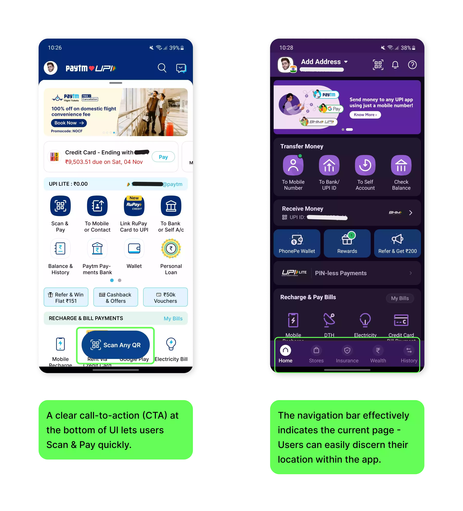
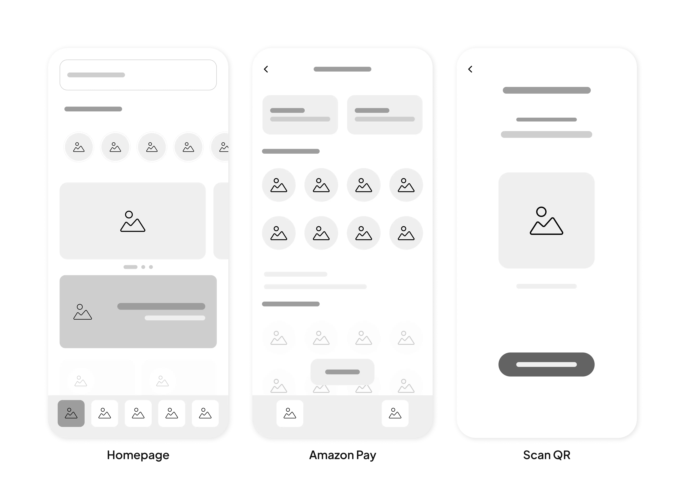

I noticed that many of my friends and acquaintances shop on Amazon but don't use Amazon Pay, the payment service Amazon offers right within the Amazon app. This got me thinking about why there's a gap between how much people shop on Amazon and how little they use Amazon Pay. Based on my findings, a majority of users, especially within the 18-30 age group, were found to underutilize Amazon Pay, favouring alternative platforms like Cred or PhonePe. I resolved to pinpoint and address any User Experience (UX) issues.

### To get a better idea of the challenges that users face, I conducted a survey.

I have asked people on my Instagram to take part in the survey through a Google form. The survey is to find out their experiences with using Amazon Pay. Questions were asked about their age group, their most used app for online payments, how frequently they use Amazon Pay, and how conveniently they can navigate to and use Amazon Pay. All the participants are between the ages of 18 - 30. The image below shows the survey results

Survey Results

#### Observations based on survey
Nearly 70% of participants use Cred or PhonePe. A mere 6% of them use Amazon Pay as their primary payments app. Most of the participants use Amazon Pay rarely or only while shopping on Amazon. Only 15% of them use it regularly (but not necessarily be their primary app). There are mixed opinions about how conveniently can people navigate to the pay section in the Amazon app. Almost half of the users face difficulty in accessing the Amazon Pay page. Nearly 85% of the participants can complete a scan and pay task without feeling challenged.

#### In-depth analysis of Amazon Pay app.

Finding the Amazon Pay section is excessively complex, particularly for new or non-tech-savvy users. While familiar users might manage, the numerous steps involved make it nearly impossible for newcomers to navigate to the Pay section smoothly. Below is the in-depth ananlysis of the challenges faced while using Amazon Pay

Problem #01

Problem #02

 
Problem #03

#### Competitor Analysis

Let us observe some apps that are primarily payment (UPI) apps.

Paytm & PhonePe

There are some apps that are not primarily UPI apps, but have integrated the pay feature so well.

WhatsApp, Cred & Groww

#### Pain points and user needs
After conducting extensive user research and a thorough analysis of Amazon Pay alongside competitor apps, several critical user pain points have surfaced that demand immediate attention.

User Pain points

Improving these aspects could significantly enhance the user experience and usability of Amazon Pay, making it more competitive and user-friendly in the digital payment landscape.

### Ideation and Design Process

#### Digital Wireframes
After examining the issues and requirements of the users, I began brainstorming and created preliminary low-fidelity prototypes.

Low Fidelity Wireframes

Designed the homepage with emphasis on the Amazon Pay Banner and a button to quickly scan and pay. Redesigned the Amazon Pay Page with simple navigation.

#### Refining  the designs

Redesigned Homepage

Redesigned Pay Section

#### Final Mockups 

### Learnings from this personal project

A comprehensive evaluation of Amazon Pay revealed surprising findings regarding user adoption and experience. Despite Amazon's dominance in the e-commerce landscape, Amazon Pay's usage and acceptance were unexpectedly low. The pain points signified the pressing need for substantial improvements in navigation, UI clarity, and overall design hierarchy in Amazon Pay.

This project focuses on enhancing the user experience through redesigning critical sections such as the homepage, and the payment section. Through this case study, the aim is to highlight the critical areas for improvement and the solutions proposed to enhance Amazon Pay, providing users with a more intuitive and efficient payment experience while navigating through the Amazon app.

