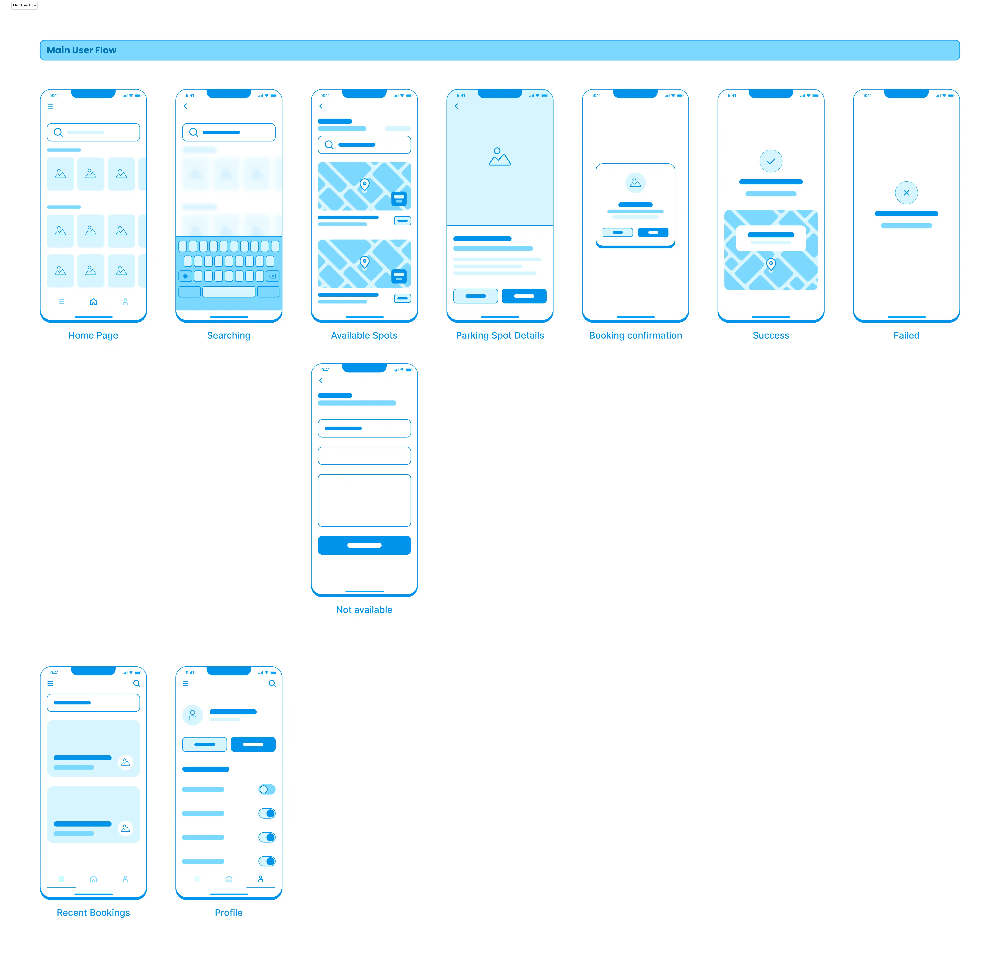
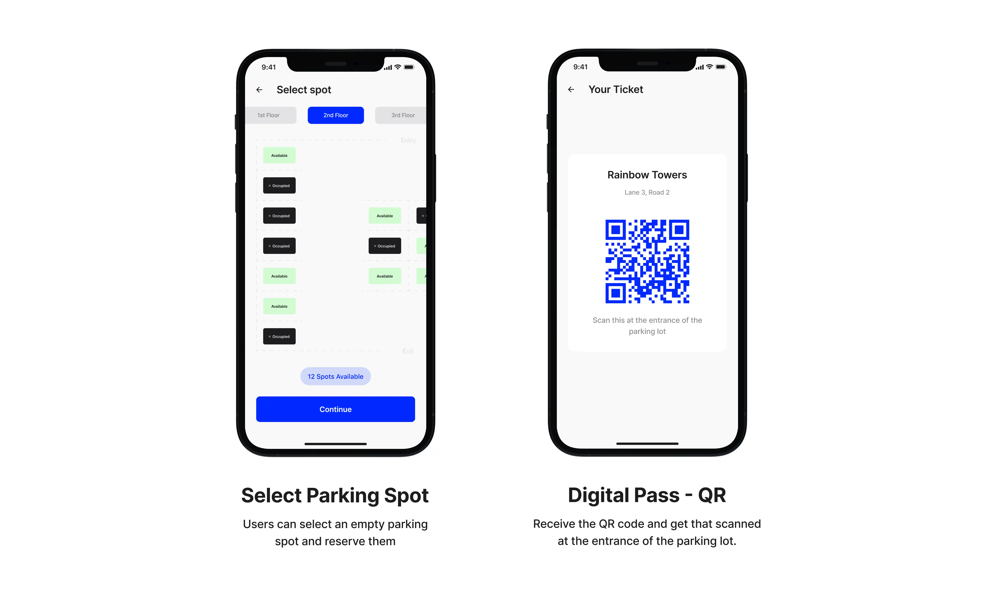

This case study focuses on addressing the challenges faced by employees working in big cities, such as unorganized parking systems and time-consuming searches. The solution entails a mobile app designed to optimize employees’ parking experiences by improving parking efficiency, enhancing user convenience, and providing real-time parking information. The app features real-time availability status of parking spots, spot reservations, navigation, and digital passes. This case study aims to improve the parking experiences of employees through user-centered design.

### The Problem 
To get a better understanding of the problem, I've created two user personas and empathy maps.

#### User 1

User Persona

Empathy Map

#### User 2

User Persona

Empathy Map

#### Defining the problems
Based on the User Research, I have narrowed down three primary issues have been identified.

Defined Problems

### Ideation and Design Process
#### Project Goals
Based on the defined problems, some possible solutions include

Project Goals

#### User Flow

User Flow - Signin

User Flow - Main Flow

#### Digital Wireframes

Before diving into crafting polished designs, I've rapidly brainstormed some sleek, low-fidelity wireframes to lay the groundwork.

Wireframes - Onboarding

Wireframes - Main

### Design Solution 

#### Design System

Style Guide

Logo

Components

### Final Mockups & Live Prototype

Mockups - Light

Mockups - Dark

<iframe class="hidden md:inline-flex" style="border: 1px solid rgba(0, 0, 0, 0.1);" width="100%" height="750" src="https://www.figma.com/embed?embed_host=share&url=https%3A%2F%2Fwww.figma.com%2Fproto%2FTkMNXHhtCYDQDaAmnmeTcL%2Fparked%3Fnode-id%3D382-8464%26t%3DfPBFWgog63QchWan-1%26scaling%3Dscale-down%26page-id%3D382%253A8073%26starting-point-node-id%3D382%253A8076%26show-proto-sidebar%3D1" allowfullscreen></iframe>

### Scope for possible improvements

<strong>Registering with car details</strong> - The users can be asked to register their car details at sign-up. This allows us to recommend more suitable parking spots according to their vehicles.

<strong>‍Paid parking system</strong> - Currently, the app is limited to managing parking in office buildings. However, we could develop the app further to make it accessible to the general public. This would allow building owners to list their available parking spaces and allow drivers to park their vehicles. By doing so, both parties can benefit from this arrangement.

