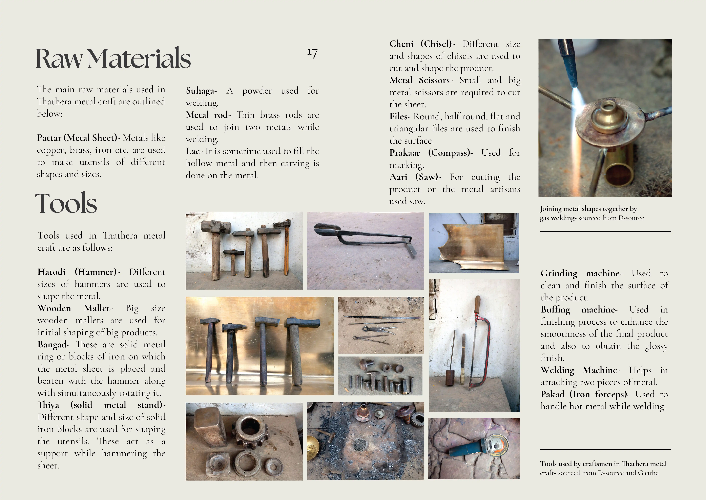
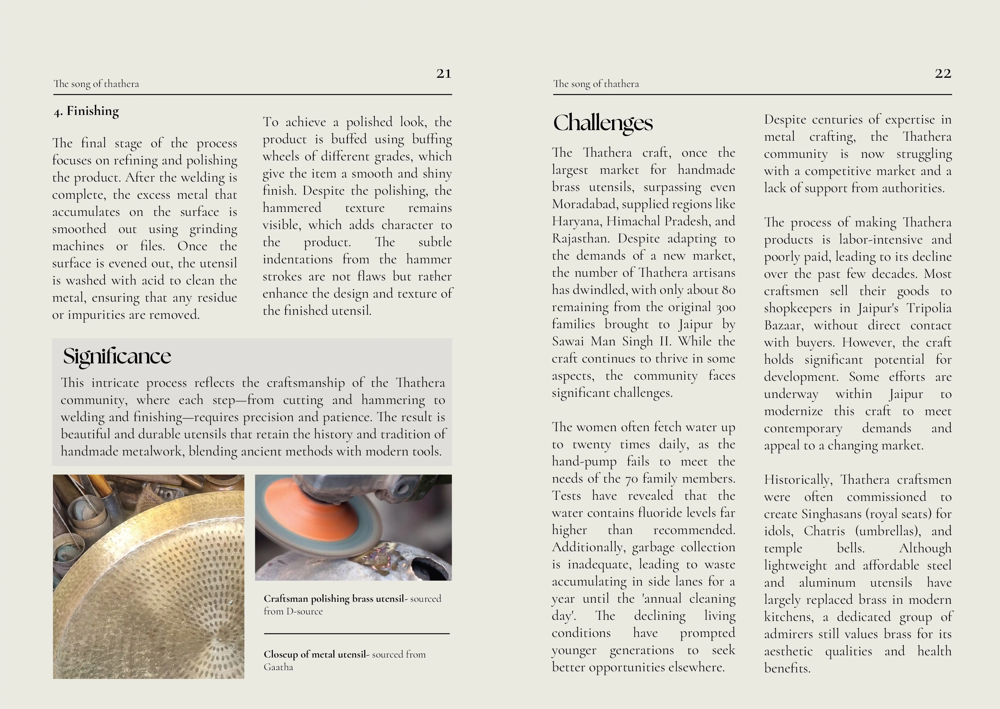
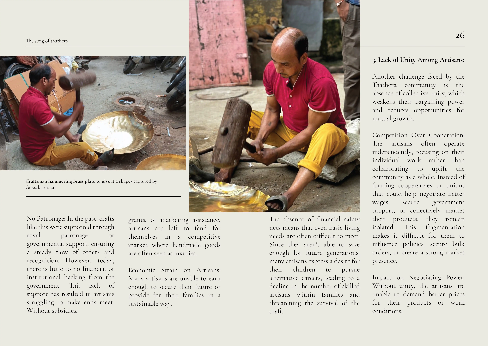
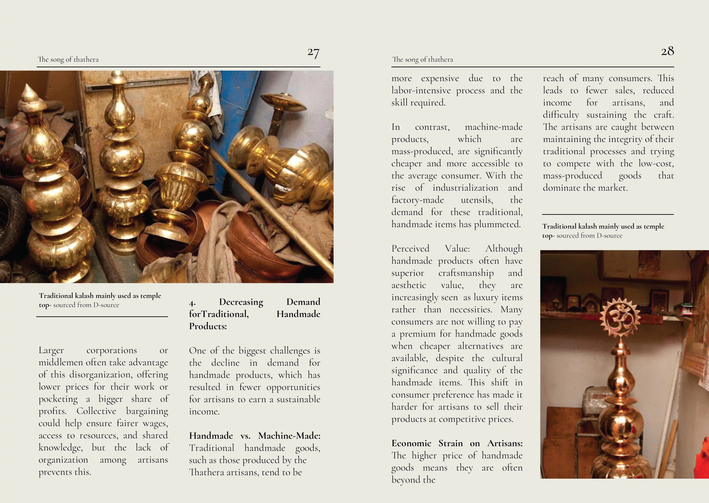
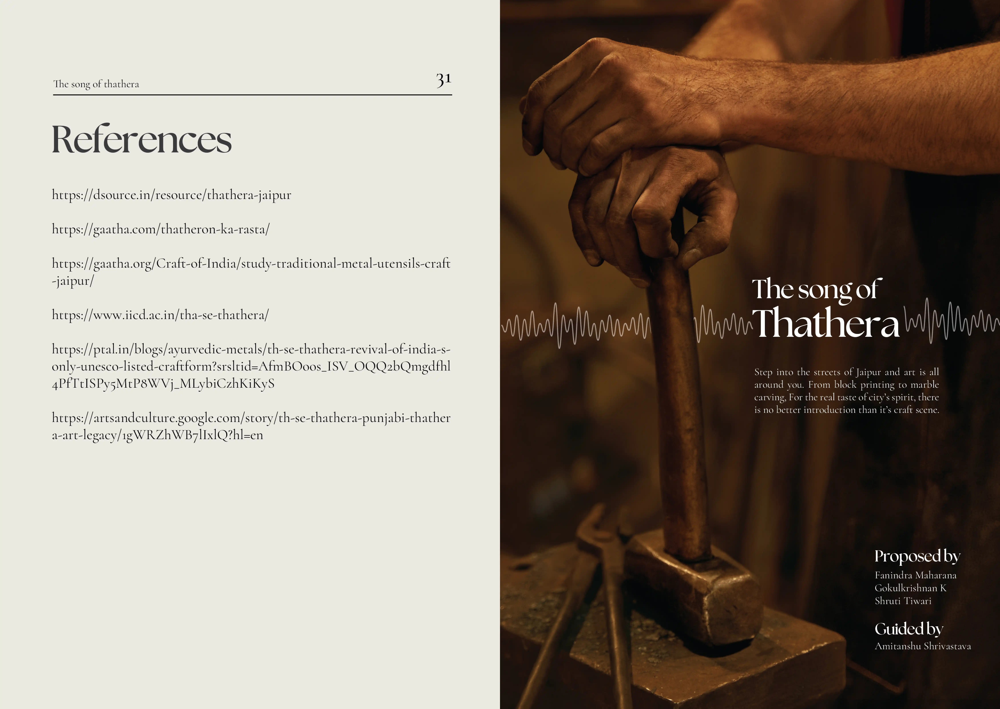

In the first semester of my M.Des, we had the course - **Crafts, Cultures, and Habitat Studies**, and as a part of this, we got to explore Jaipur’s rich crafts and culture. We spent time with the artisans practicing **Thathera craft**, a traditional metalworking art. Talking to them, we heard their stories—about their craft, their struggles, and their daily lives. Inspired by our experience, **we created a book** capturing everything we learned and discovered. 

#### The Team

1. <a href="https://www.linkedin.com/in/fanindra-m/" external>Fanindra Maharana</a> (me)
2. <a href="https://www.linkedin.com/in/gokul-krishna-3891ab203/" external>Gokulkrishnan K</a>
3. <a href="https://www.linkedin.com/in/shruti-tiwari-0a716422a/" external>Shruti Tiwari</a>

### The book that we put together!

