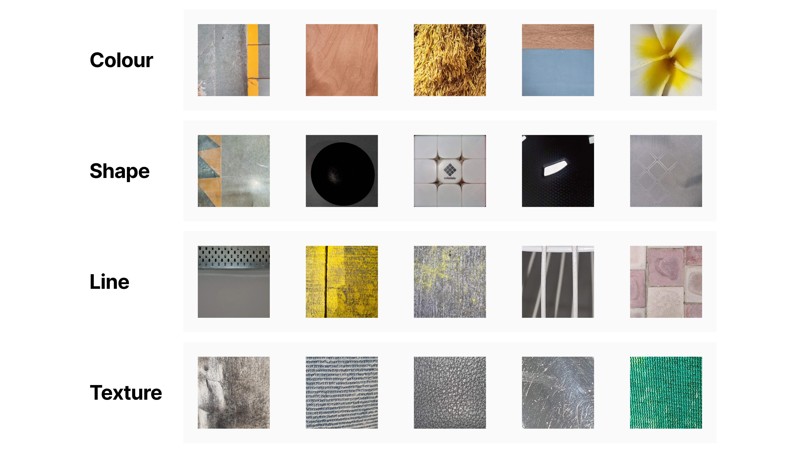
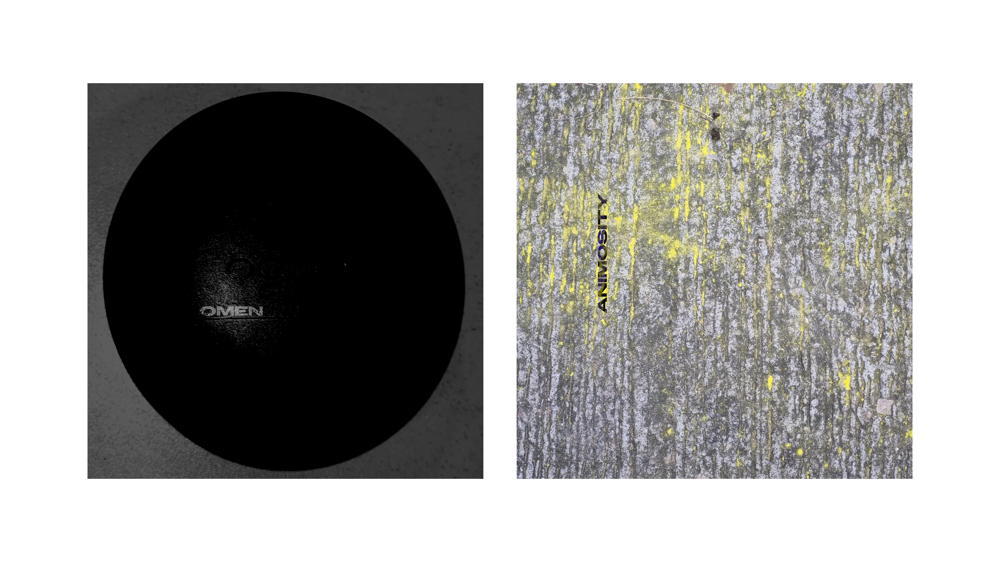
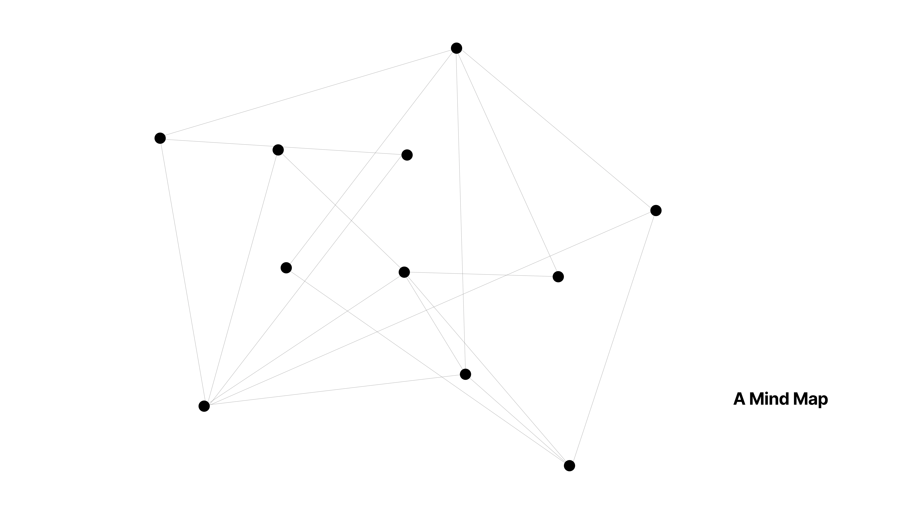
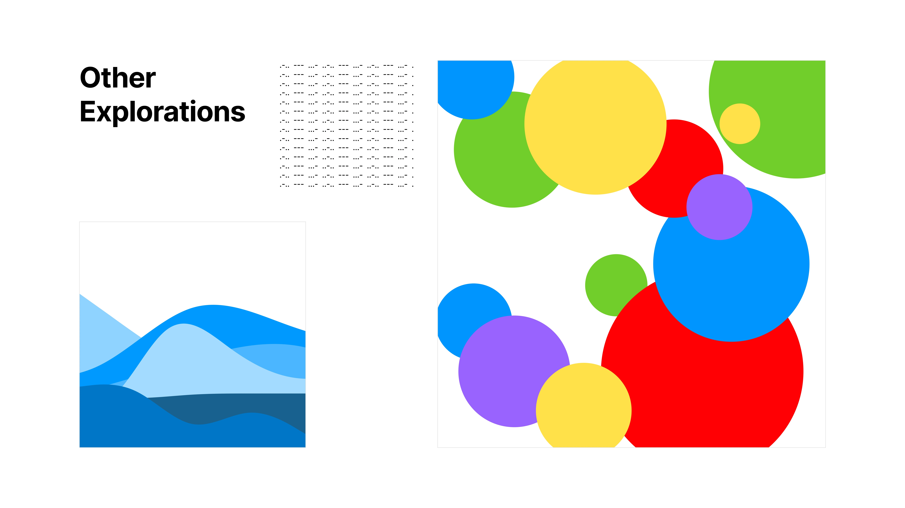
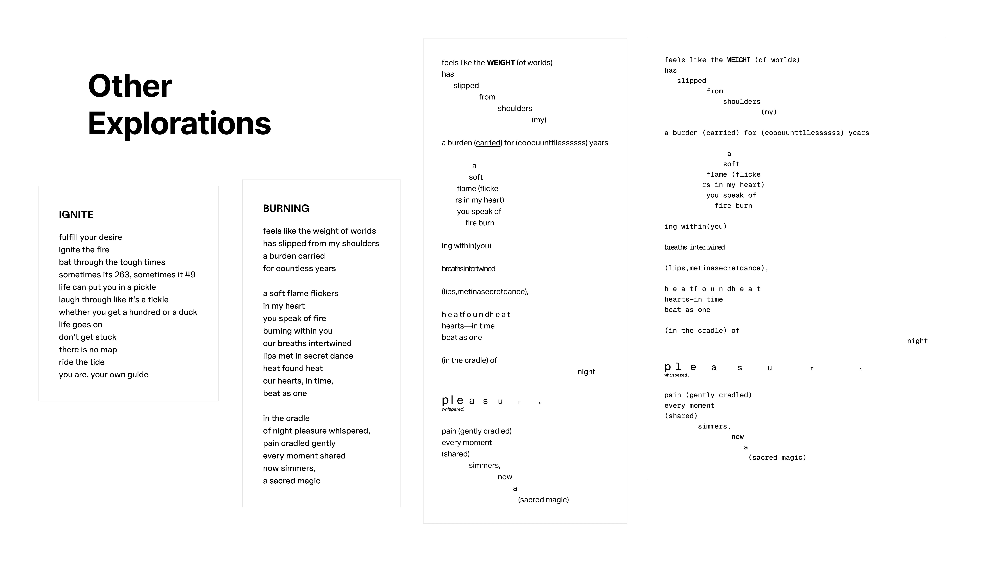
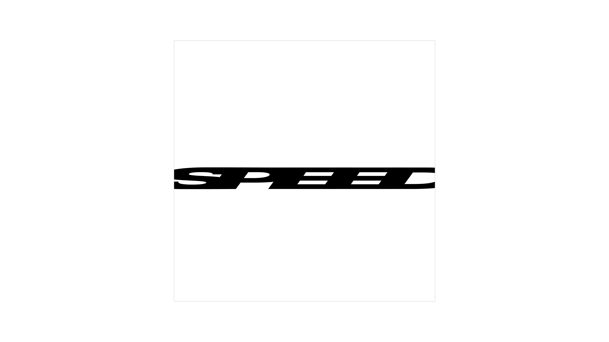
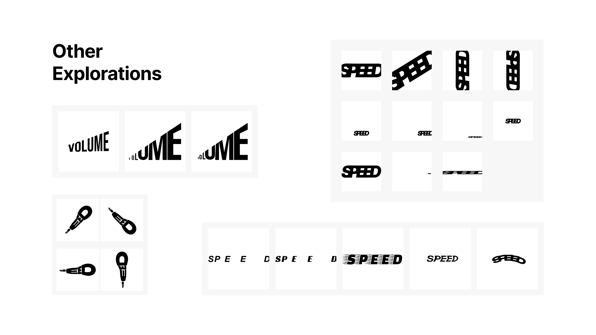
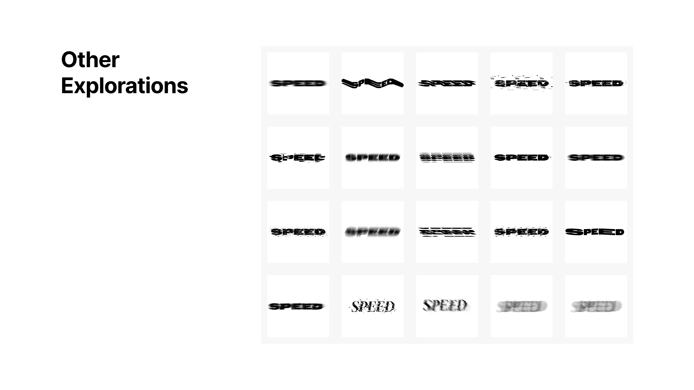
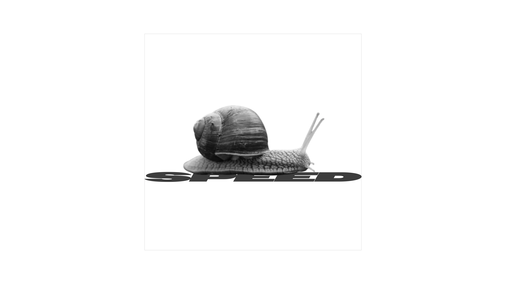
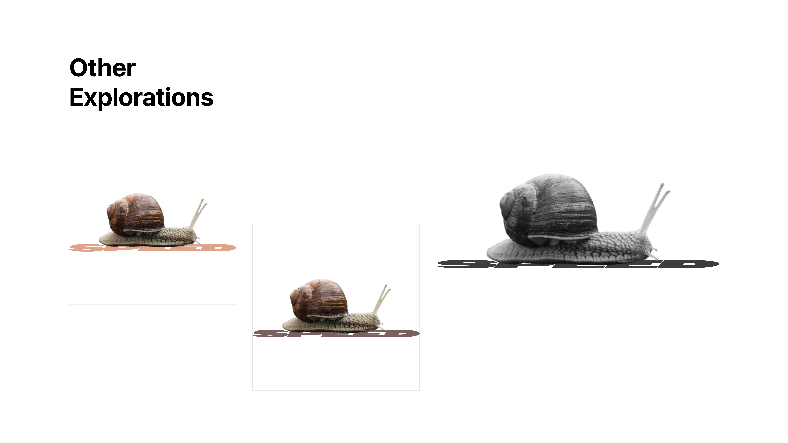

---
### Task 1: Elements of Design
**Brief:** Showcase images that represent each element of design

---
### Task 2: Word on an image
**Brief:** Add a word to an image to add a new layer of meaning to it

---
### Task 3: Definition of word
**Brief:** Make a composition that represents your definition of **word**

#### My Definitions of image and word
**Image** is a frozen moment in time - a memory out of visuals where as; **Word** is a way of expressing our thoughts, emotions, etc. 

---
### Task 4: Poem
**Brief:** Make a poem composition representing the overall essence of the poem

**buRn**

---
### Task 5: Semantic Typography
**Brief:** Visualize the meaning of a word, using only graphic elements of the letters

---
### Task 6: Contradictory Image
**Brief:** For the word from the previous task, compose an image such that the image contradicts the essence of that word

