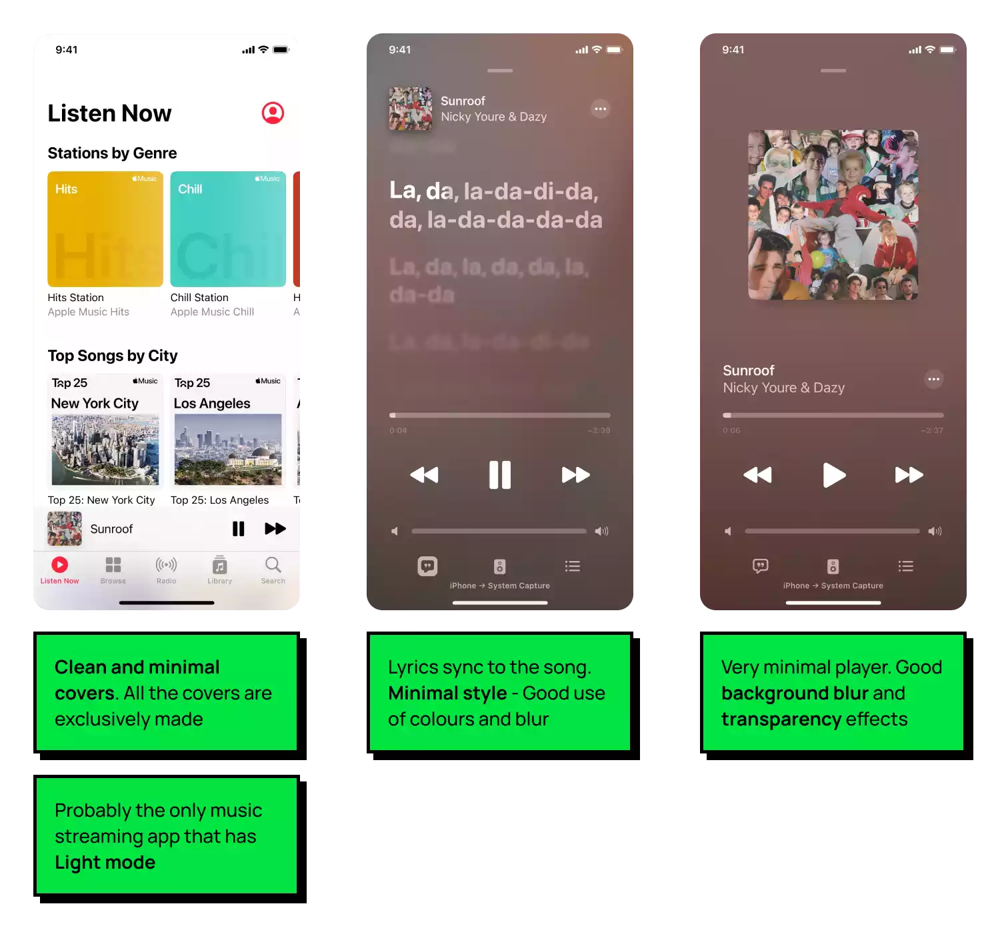

I have redesigned the YouTube Music Android application, preserving its original essence while implementing necessary changes. Specifically, I crafted a light theme version for the home screen as part of an internship screening assessment.

### The Problem

The problems with the current version of the app are highlighted in red.

Problems #01

Problems #02

### Ideation and Design Process
#### Competitive Analysis & Finding Inspiration

Spotify

Apple Music

#### Project Goals
After identifying the issues with YouTube Music and conducting a comprehensive analysis of competing apps like Spotify and Apple Music, I've distilled the problems into the following key challenges:

Project Goals

### Design Solution 

Light Theme

Dark Theme

### Conclusion

This project aimed to enhance the YouTube Music Android app's user experience while staying true to its core identity. Inspired by competitors like Spotify and Apple Music, a light theme refreshed the home screen. It is important to note that this redesign is focused solely on the homepage, player page, and lyrics tab to improve accessibility and engagement. It preserved the app's essence while making necessary changes for a more user-friendly and visually appealing experience.

